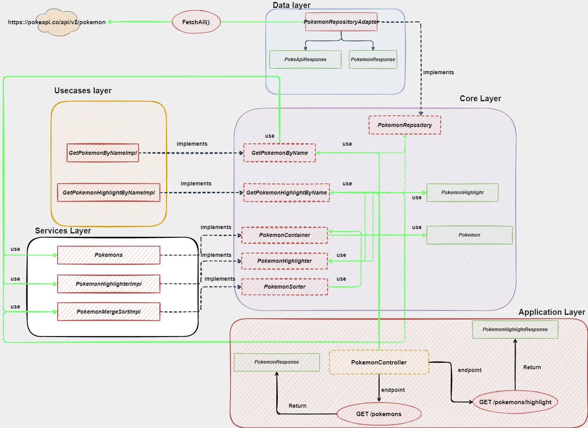

# Backend Looqbox Challenge

[Looqbox Challenge Doc](./code-challenge.md#guidelines)

## Run application

- docker:
  > Run following the command in terminal to build image: `docker image build -t pokemon-service .` Then run the command to run the container
  > `docker run --name pokemon-service -p 8080:8080 pokemon-service`

- docker-compose:
  > docker-compose up -d

## Diagram

